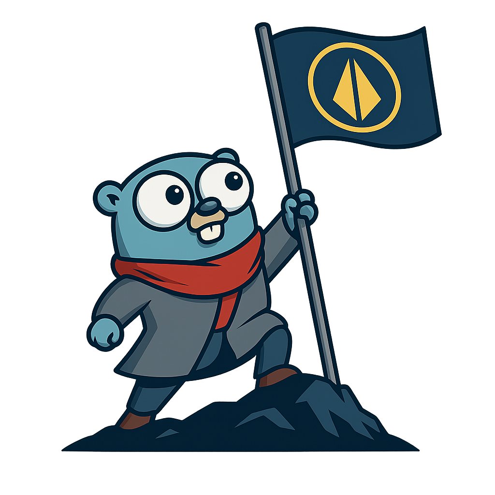

# Foundation

  

Foundation is a simple Golang Application framework inspired by Golangs `testing` framework. It does not make any assumptions about what and how you want things to run but it does provide the building blocks to run your application your way.

However if you would like an opinionated way of running your application which will come with batteries included compoenets like OpenTelemetry and health check server support you should checkout the `blueprint` package.
